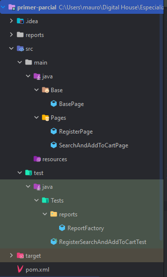

# Parcial Testing II - Carrera Certified Tech Developer

## Indice

- [Objetivo](#objetivo)
- [Caso de prueba a automatizar](#Caso-de-prueba-a-automatizar)
- [Estructura del proyecto](#estructura)

## Objetivo

Crear una prueba automatizada con Selenium para el proceso de compra parcial en el sitio web:

**_[OpenCart](https://opencart.abstracta.us/index.php?route=common/home
)_**

## Caso de prueba a automatizar

**_[Planilla de Casos de Prueba](https://docs.google.com/spreadsheets/d/1N087fr8QBbc6L9qikzECrmXOpy4NKwy5I6RiE_PWaLo/edit?usp=sharing
)_**

## Estructura del proyecto

El proyecto se desarolló siguiendo el patrón **_Page Object Model_**. Por lo tanto la estructura de carpetas es la siguiente:

- **Base:** Contiene la _BasePage_ con todos los métodos necesarios, esperas explícitas y todo lo necesario para la ejecución correcta de las pruebas.
- **Pages:** Contiene las páginas de pruebas, las mismas extienden a la _BasePage_ para utilizar todos los métodos que sean necesarios, en las páginas se encuentran los locators y los métodos de las pruebas.
- **Test:** Contiene las pruebas propiamente dicho.
    - **Reports:** Contiene la ReportFactory, para hacer uso de los reportes, utilizando la librería _Extent Reports_, en la clase de _ReportFactory_ se tiene toda la configuración necesaria y el path donde se guardarán los reportes y los screenshots.

## Screenshot de Estructura

